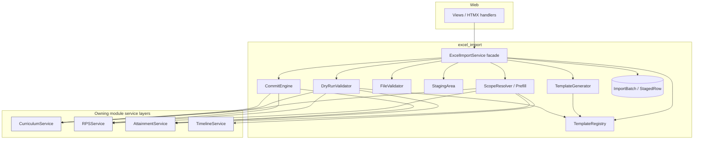
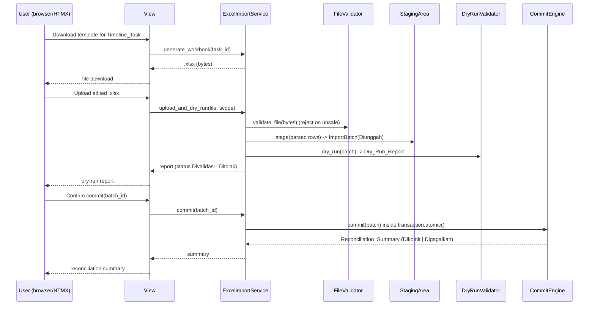
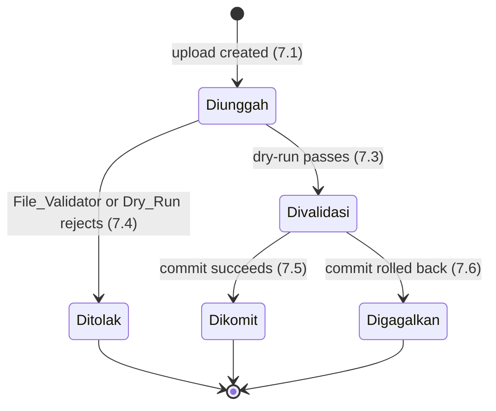

# Design Document

## Overview

The Excel Import capability delivers a safe, reproducible bulk-authoring loop for the OBE
system: **generate → download → upload → stage → dry-run → atomic commit**. It ships as a
new Django app (proposed name `excel_import`) inside the existing Django + PostgreSQL
modular monolith. All rendering is server-side (Django templates + HTMX); there is no new
container, worker, or message broker — the full loop runs synchronously inside one request
cycle.

The module is a thin, self-contained subsystem that orchestrates a set of focused
components behind a single facade, `ExcelImportService`. It **never** touches the
persistence models of other modules. It reads and writes Curriculum, RPS, Attainment, and
Timeline data exclusively through their published service layers
(`CurriculumService`, `RPSService`, `AttainmentService`, `TimelineService`). This keeps the
import loop decoupled from module internals and lets a future JSON API reuse the exact same
service layer without change.

Two invariants dominate the design and are treated as non-negotiable:

1. **Determinism** — identical inputs produce byte-identical workbooks.
2. **All-or-nothing, idempotent commit** — a batch commits inside one transaction and
   re-uploading the same file never creates duplicates.

Language/stack for all examples: **Python 3 / Django**, `openpyxl` (pinned version) for
workbook I/O, `zipfile` for OOXML inspection, and **Hypothesis** for property-based tests.

### Design Goals and Non-Goals

| Goal | Approach |
| --- | --- |
| Deterministic generation | Fixed sheet order, sorted keys, static styles, no volatile ids/timestamps, no formulas |
| Safe uploads | Layered `.xlsx` inspection before any parse |
| No partial writes | Single `transaction.atomic()` commit through service layer |
| Idempotent retries | Business-key upsert semantics |
| Decoupling | Service-layer-only integration; views ↔ service separation |
| Future-proofing | Deferred template types registered; synchronous engine isolated behind an interface so async can be added later; facade is transport-agnostic for a future JSON API |

Non-goals for this MVP: async progress reporting, mid-run cancellation, import loops for
the deferred template types (Roster, Grades, Attainment_Measurement, CQI), and a JSON API
(the design must merely *not preclude* it).

## Architecture

### Module Placement

```
obe_system/
  excel_import/                 # NEW Django app
    services/
      facade.py                 # ExcelImportService (public entry point)
      template_registry.py      # TemplateRegistry
      template_generator.py     # TemplateGenerator
      file_validator.py         # FileValidator (safety pipeline)
      staging.py                # StagingArea
      dry_run.py                # DryRunValidator
      commit_engine.py          # CommitEngine
      scope_resolver.py         # Timeline linking + prefill
    models.py                   # ImportBatch, StagedRow, TemplateDefinition
    definitions/                # Declarative TemplateDefinition seeds (versioned)
    errors.py                   # DomainError hierarchy + message catalog
    views.py                    # HTMX request handlers (thin)
    migrations/
  curriculum/  (existing)  -> exposes CurriculumService
  rps/         (existing)  -> exposes RPSService
  attainment/  (existing)  -> exposes AttainmentService
  timeline/    (existing)  -> exposes TimelineService
```

The import app depends only on the *service* modules of its peers, not on their `models`.
This dependency direction is enforced by an architecture boundary test (Req 9.1).

### Component Diagram



Only `ScopeResolver`, `DryRunValidator`, and `CommitEngine` reach out to owning-module
services; every such call is mediated by the service layer. `DryRunValidator` reads only;
`CommitEngine` is the sole writer.

### Request Flow (synchronous)



### Architecture Constraints (Req 9)

- **Service-layer-only integration (9.1):** the import app imports peer *services*, never
  peer `models`. Enforced by a boundary/import test.
- **Views ↔ service separation (9.2):** `ExcelImportService` accepts plain data
  (`bytes`, ids, DTOs) and returns plain DTOs, with no `HttpRequest`/`HttpResponse`
  dependency, so a JSON API can call it directly.
- **Parameterized access (9.3):** all persistence uses the Django ORM; no
  string-concatenated SQL.
- **Migrations (9.4):** all schema changes ship as Django migrations.
- **No extra container (9.5):** runs inside the existing web + db containers; no broker,
  no worker.

## Components and Interfaces

All public methods are transport-agnostic (no request/response objects) so the facade is
reusable by both the HTMX views and a future JSON API.

### ExcelImportService (Facade)

```python
class ExcelImportService:
    def __init__(self, registry, generator, scope_resolver,
                 file_validator, staging, dry_run, commit_engine): ...

    # Generation + prefill
    def generate_workbook(self, template_type: str, *,
                          timeline_task_id: str | None = None) -> bytes: ...

    # Upload -> stage -> dry-run (no writes)
    def upload_and_dry_run(self, file_bytes: bytes,
                           declared_mime: str) -> DryRunReport: ...

    # Atomic commit of a validated batch
    def commit(self, batch_id: str) -> ReconciliationSummary: ...

    # Read-only status/report accessors
    def get_batch(self, batch_id: str) -> ImportBatchDTO: ...
    def get_report(self, batch_id: str) -> DryRunReport: ...
```

The facade owns lifecycle transitions on `ImportBatch` and delegates work to the components.

### TemplateRegistry

Authoritative, versioned catalog. Backed by `TemplateDefinition` rows seeded from
declarative files in `definitions/`.

```python
class TemplateRegistry:
    def list_types(self) -> list[TemplateTypeInfo]: ...          # all 8, with impl/deferred flag
    def is_implemented(self, template_type: str) -> bool: ...
    def get_current(self, template_type: str) -> TemplateDefinition: ...
    def get_version(self, template_type: str, schema_version: str) -> TemplateDefinition: ...
    def implemented_types(self) -> list[str]: ...                # for error messages
    def require_implemented(self, template_type: str) -> None:   # raises DeferredTemplateError
        ...
```

- Registers all 8 types (Req 1.1); flags Curriculum/CPL/RPS/Rubric implemented and
  Roster/Grades/Attainment_Measurement/CQI deferred (Req 1.2).
- Each `TemplateDefinition` carries fields, reference sources, validation rules, business
  key (Req 1.3), and a `schema_version` (Req 1.4).
- Definitions are **append-only versioned**: editing seeds a new version row; prior
  versions are retained (Req 1.5, 1.6).
- `require_implemented` raises a `DeferredTemplateError` naming available types (Req 1.7).

### TemplateGenerator

Produces deterministic `.xlsx` bytes from a `TemplateDefinition` plus resolved scope,
reference, and prefill data. Details in *Deterministic Excel Generation*.

### ScopeResolver / Prefill

Resolves `Import_Scope` and gathers prefill/reference datasets through services. Details in
*Template ↔ Timeline-Task Linking and Prefill*.

### FileValidator

Layered safety pipeline over raw upload bytes. Details in *Safe Workbook Upload
Validation*. Emits file-level `DomainError`s; never parses business content until all safety
checks pass.

### StagingArea

Persists parsed `Data` rows as `StagedRow` records attached to an `ImportBatch` **before any
write to owning modules** (Req 5.1).

```python
class StagingArea:
    def stage(self, batch: ImportBatch, parsed_rows: list[ParsedRow]) -> None: ...
    def rows(self, batch: ImportBatch) -> list[StagedRow]: ...
```

### DryRunValidator

Validates staged rows, classifies them, and produces a `DryRunReport` with **no writes**
(Req 5.2–5.7). Reads current data through services for classification only.

```python
class DryRunValidator:
    def dry_run(self, batch: ImportBatch) -> DryRunReport: ...
```

### CommitEngine

Sole writer. Performs a single-transaction, business-key upsert of committable rows through
services (Req 6). Details in *Atomic and Idempotent Commit*.

```python
class CommitEngine:
    def commit(self, batch: ImportBatch) -> ReconciliationSummary: ...
```

## Data Models

New tables live in the `excel_import` app; owning-module data is untouched.

### ImportBatch

```python
class ImportStatus(models.TextChoices):
    DIUNGGAH   = "Diunggah",   "Diunggah"     # uploaded
    DIVALIDASI = "Divalidasi", "Divalidasi"   # validated
    DITOLAK    = "Ditolak",    "Ditolak"      # rejected
    DIKOMIT    = "Dikomit",    "Dikomit"      # committed
    DIGAGALKAN = "Digagalkan", "Digagalkan"   # failed

class ImportBatch(ProductionReadinessModel):     # reuses shared readiness base
    id            = models.UUIDField(primary_key=True, default=uuid4, editable=False)
    template_type = models.CharField(max_length=40)      # e.g. "Curriculum"
    schema_version = models.CharField(max_length=20)
    # Import_Scope
    prodi         = models.CharField(max_length=64)
    period        = models.CharField(max_length=32)
    klass         = models.CharField(max_length=64, blank=True)
    timeline_task_id = models.CharField(max_length=64, null=True, blank=True)
    status        = models.CharField(max_length=12, choices=ImportStatus.choices,
                                     default=ImportStatus.DIUNGGAH)
    content_hash  = models.CharField(max_length=64)      # sha256 of uploaded bytes (idempotency aid)
```

`status` is constrained to the five enum values (Req 7.2) and carries the scope, type, and
version (Req 7.1). `ProductionReadinessModel` supplies prodi/owner/status/version/creator/
created-time/modified-time reused across the system.

### StagedRow

```python
class RowClassification(models.TextChoices):
    NEW       = "New_Row"
    CHANGED   = "Changed_Row"
    UNCHANGED = "Unchanged_Row"
    DUPLICATE = "Duplicate_Row"
    REJECTED  = "Rejected_Row"

class StagedRow(models.Model):
    batch          = models.ForeignKey(ImportBatch, on_delete=models.CASCADE,
                                       related_name="rows")
    row_index      = models.PositiveIntegerField()      # 1-based Data sheet row
    raw_values     = models.JSONField()                 # {field_name: raw_cell_value}
    business_key   = models.CharField(max_length=255, db_index=True)  # computed key
    classification = models.CharField(max_length=16, choices=RowClassification.choices,
                                      null=True)         # assigned during dry-run
    cell_errors    = models.JSONField(default=list)      # [{field, problem, corrective_step}]

    class Meta:
        unique_together = ("batch", "row_index")
```

### TemplateDefinition

```python
class TemplateDefinition(models.Model):
    template_type  = models.CharField(max_length=40)
    schema_version = models.CharField(max_length=20)
    is_implemented = models.BooleanField(default=False)
    fields         = models.JSONField()   # ordered field specs (name, label, type, required)
    reference_sources = models.JSONField()# [{name, service, method, columns}]
    validation_rules  = models.JSONField()# [{field, rule, params, message_key}]
    business_key   = models.JSONField()    # ordered list of field names
    created_at     = models.DateTimeField(auto_now_add=True)

    class Meta:
        unique_together = ("template_type", "schema_version")   # append-only history
```

Append-only: a definition change inserts a new `(template_type, schema_version)` row; prior
rows are never mutated or deleted (Req 1.5, 1.6). The `business_key` field list drives both
duplicate detection and upsert (Req 5.4, 6.3).

### ProductionReadinessModel (reuse)

The existing shared abstract base providing `prodi`, `owner`, `status`, `version`,
`creator`, `created_at`, `modified_at`. `ImportBatch` inherits it, and the CommitEngine
records these `Production_Readiness_Fields` on owning-module records through their services
(Req 6.7).

## Deterministic Excel Generation

`TemplateGenerator` builds each workbook with `openpyxl` (pinned version so the library's
own serialization is stable). The five sheets are always created in a fixed order:

1. **Petunjuk** (instructions) — static, definition-driven text.
2. **Metadata** — scope + identity, including embedded `Template_Id` and `Schema_Version`.
3. **Data** — editable rows (prefilled where prior data exists).
4. **Referensi** — read-only reference data.
5. **Validasi** — the validation rules from the definition (Req 2.1, 2.3).

### Embedded identity (Req 2.2)

`Template_Id` and `Schema_Version` are written in two places for robust round-trip reads:

- Named cells in the **Metadata** sheet (`Metadata!B1`, `Metadata!B2`), and
- Workbook `docProps/custom` custom properties (`template_id`, `schema_version`).

Upload parsing reads them back to select the correct `TemplateDefinition`.

### Byte-stable output strategy (Req 2.4)

Determinism is achieved by removing every source of nondeterminism from the output:

```python
def generate(self, definition, scope, reference_rows, prefill_rows) -> bytes:
    wb = Workbook()
    wb.remove(wb.active)                      # drop implicit default sheet

    # 1. Fixed sheet order
    self._build_petunjuk(wb, definition)
    self._build_metadata(wb, definition, scope)
    self._build_data(wb, definition, sorted_rows(prefill_rows, definition.business_key))
    self._build_referensi(wb, sorted_rows(reference_rows, key=stable_key))
    self._build_validasi(wb, definition.validation_rules)  # rules in definition order

    # 2. No volatile identifiers / timestamps
    wb.properties.created = FIXED_EPOCH       # constant, not datetime.now()
    wb.properties.modified = FIXED_EPOCH
    wb.properties.creator = "OBE Excel Import"

    # 3. Serialize; then normalize the OOXML zip for byte stability
    raw = save_virtual_workbook(wb)
    return normalize_xlsx_zip(raw)
```

Rules applied:

- **Fixed sheet order** and fixed column order (from `definition.fields`).
- **Sorted keys**: data rows sorted by business key; reference rows sorted by a stable key;
  any dict serialized with sorted keys. No reliance on Python dict/iteration order.
- **Fixed styles**: a small, static style palette assigned by column; no dynamic style ids.
- **No volatile metadata**: workbook `created`/`modified` set to a constant epoch; no
  random ids, GUIDs, or `datetime.now()` anywhere.
- **No value formulas** (Req 2.5): every cell is written as a literal value; the generator
  never writes a string beginning with `=` as a formula. Reference cross-sheet content is
  materialized as values, not formula links.
- **Zip normalization** (`normalize_xlsx_zip`): re-pack the OOXML parts in a fixed archive
  member order with fixed zip timestamps (a constant `date_time`) and fixed compression, so
  two runs produce identical bytes even though a raw zip embeds per-entry timestamps.

The combination of a pinned `openpyxl`, constant document metadata, sorted content, and a
normalized zip yields the byte-identical guarantee for identical inputs.

## Template ↔ Timeline-Task Linking and Prefill

When a user requests a workbook for a `Timeline_Task`, `ScopeResolver` assembles everything
through services (never through peer models):

```python
class ScopeResolver:
    def resolve(self, template_type, timeline_task_id):
        task = self.timeline_service.get_task(timeline_task_id)         # Req 3.1
        scope = ImportScope(prodi=task.prodi, period=task.period, klass=task.klass)
        template_type = template_type or task.template_type            # Req 3.4 consistency
        return scope, template_type

    def reference_data(self, definition, scope):
        # each reference source names a service + method (Req 3.2)
        out = {}
        for src in definition.reference_sources:
            svc = self._service_for(src["service"])   # curriculum/rps/attainment
            out[src["name"]] = getattr(svc, src["method"])(scope)
        return out

    def prior_data(self, definition, scope):
        # prior editable data for prefill, read via services (Req 3.3)
        svc = self._service_for(definition.owner_service)
        return svc.list_editable(scope, template_type=definition.template_type)
```

- **Scope → Metadata (3.1):** prodi/period/class resolved via `TimelineService` and written
  into the Metadata sheet.
- **Reference → Referensi (3.2):** each `reference_source` in the definition names an owning
  service + read method; results fill the Referensi sheet.
- **Prior data → Data (3.3):** existing editable records for the scope prefill the Data
  sheet so the user starts from real context.
- **Type consistency (3.4):** the workbook's recorded `Template_Type` equals the task's
  associated type; a mismatch is rejected before generation.

## Safe Workbook Upload Validation

`FileValidator` runs an ordered pipeline on the raw upload **before any business parse**.
Each stage raises a file-level `DomainError` with a plain-language message on failure
(Req 8.2). The pipeline uses `zipfile` to inspect the OOXML package and `openpyxl` (in
read-only, data-safe mode) only after structural checks pass.


| Check | Requirement | How it is performed |
| --- | --- | --- |
| Extension is `.xlsx` only | 4.1 | Reject any other extension; then confirm the bytes are a valid OOXML zip (magic `PK\x03\x04`), so a renamed non-xlsx fails. |
| Declared MIME matches xlsx | 4.2 | Compare the upload's declared content type against `application/vnd.openxmlformats-officedocument.spreadsheetml.sheet`. |
| Max size | 4.3 | Reject if raw byte length exceeds the configured limit, before opening. |
| Zip-bomb guard | 4.4 | Open with `zipfile`; sum `ZipInfo.file_size` (decompressed) and compute ratio `file_size / compress_size` per entry and overall. Reject if total decompressed size exceeds the limit or any ratio exceeds the configured cap. |
| Macro detection | 4.5 | Reject if the archive namelist contains `xl/vbaProject.bin` or any `.bin` macro part / xlsm-style content type. |
| Password / encryption | 4.6 | An encrypted OOXML file is an OLE compound file, not a zip: detect the OLE CFB magic (`D0 CF 11 E0`) or an `EncryptedPackage`/`EncryptionInfo` stream and reject. A `BadZipFile` on open with the OLE signature is treated as encrypted. |
| External links / embedded objects | 4.7 | Reject if namelist contains `xl/externalLinks/*`, `externalLink` relationship targets, or embedded-object parts (`xl/embeddings/*`, `oleObject*`, `xl/media/*` OLE objects). |
| Value-formula scan | 4.8 | Load with `openpyxl.load_workbook(..., data_only=False)` and scan every cell; reject if any cell `data_type == "f"` or a string cell begins with `=`. Report the sheet + cell location. |

The order matters: cheap/structural checks run first; parsing (the most expensive and
attack-surface-heavy step) runs last and only on a file already proven structurally safe.

## Staging and Dry-Run

Once a file passes validation, the `Data` sheet is parsed into `ParsedRow`s and persisted as
`StagedRow`s under a new `ImportBatch` (status `Diunggah`) — **before any owning-module
write** (Req 5.1). `DryRunValidator` then runs entirely read-only (Req 5.6).

### Schema-version selection & mismatch (Req 5.7)

The embedded `Template_Id` + `Schema_Version` select the `TemplateDefinition`. If no such
version exists in the registry, the batch is rejected (`status = Ditolak`) with a message
identifying the mismatch and the corrective step (regenerate from the current template).

### Per-row validation & classification

```python
def dry_run(self, batch):
    definition = self.registry.get_version(batch.template_type, batch.schema_version)  # 5.7
    rows = self.staging.rows(batch)

    # intra-batch duplicate detection by business key (5.4)
    key_counts = Counter(r.business_key for r in rows)

    # current records for change detection, read via services (no writes)
    current = self.owner_service(definition).snapshot_by_key(batch.scope)

    report = DryRunReport(batch_id=batch.id)
    for row in rows:
        errors = self._validate_cells(row, definition)   # 5.2 -> per-cell errors
        if errors:
            classification = RowClassification.REJECTED
        elif key_counts[row.business_key] > 1:
            classification = RowClassification.DUPLICATE  # 5.4
        elif row.business_key not in current:
            classification = RowClassification.NEW
        elif current[row.business_key] == row.normalized_values():
            classification = RowClassification.UNCHANGED
        else:
            classification = RowClassification.CHANGED
        row.classification = classification               # exactly one (5.3)
        row.cell_errors = errors
        report.add(row)                                   # one entry per row (5.5)

    report.save_classifications(rows)                     # persist; still no target writes
    return report
```

- **Validation (5.2):** each cell checked against the definition's rules; violations become
  per-cell errors with problem + corrective step.
- **Classification (5.3):** every row gets exactly one of New/Changed/Unchanged/Duplicate/
  Rejected.
- **Duplicate (5.4):** rows sharing a business key with another staged row in the same batch
  are `Duplicate_Row`.
- **Report (5.5):** one report entry per staged row, with classification and any errors.
- **No writes (5.6):** classification compares against a read-only snapshot; nothing is
  written to owning modules.

On success (no schema mismatch), the facade sets `status = Divalidasi` (Req 7.3); on file or
dry-run rejection, `status = Ditolak` (Req 7.4).

## Atomic and Idempotent Commit

`CommitEngine` is the only writer. It commits all **committable** rows (everything except
`Rejected_Row`, Req 6.6) inside a single transaction (Req 6.1), upserting by business key.

```python
def commit(self, batch):
    definition = self.registry.get_version(batch.template_type, batch.schema_version)
    svc = self.owner_service(definition)
    summary = ReconciliationSummary()
    try:
        with transaction.atomic():                        # single DB transaction (6.1)
            for row in self.staging.rows(batch):
                if row.classification == RowClassification.REJECTED:
                    summary.rejected += 1                 # excluded (6.6)
                    continue
                if row.classification == RowClassification.UNCHANGED:
                    summary.skipped += 1
                    continue
                result = svc.upsert_by_business_key(       # keyed upsert (6.3)
                    key=row.business_key,
                    values=row.normalized_values(),
                    readiness=production_readiness_for(batch),  # (6.7)
                )
                if result.created:
                    summary.inserted += 1
                else:
                    summary.updated += 1
            batch.status = ImportStatus.DIKOMIT            # (7.5)
            batch.save()
    except Exception as exc:                               # any write fails
        batch.status = ImportStatus.DIGAGALKAN             # (7.6)
        batch.save()                                       # status write is its own tx
        raise CommitFailedError(...) from exc              # services unchanged (6.2)
    return summary                                         # counts (6.5)
```

- **Single transaction (6.1)** and **full rollback on any failure (6.2):**
  `transaction.atomic()` wraps every write; an exception rolls back all writes so owning
  modules are unchanged. The failure status update is written in a separate transaction so
  the `Digagalkan` state persists even though the data writes rolled back.
- **Business-key upsert (6.3):** owning services expose `upsert_by_business_key`; a matching
  record is updated, not duplicated.
- **Idempotency (6.4):** because writes are keyed upserts and `Unchanged_Row`s are skipped,
  committing the same workbook twice leaves owning modules in a state identical to a single
  commit. The batch `content_hash` additionally lets the facade recognize an identical
  re-upload.
- **Reconciliation summary (6.5):** counts of inserted/updated/skipped/rejected are returned
  and their sum equals the number of staged rows.
- **Production readiness (6.7):** each written record receives the readiness fields via the
  owning service.

## Import Batch Lifecycle / State Machine



Every transition happens synchronously within a single request cycle — no worker, no broker
(Req 7.7). The status is always one of the five allowed values (Req 7.2).

## Explainable Validation Messages

All errors are `DomainError` subclasses carrying a structured, plain-language message drawn
from a message catalog keyed by `message_key`:

```python
@dataclass
class DomainError(Exception):
    problem: str            # what is wrong, in plain language
    corrective_step: str    # what the user should do
    location: str | None = None   # sheet!cell for per-cell errors

    def to_message(self) -> dict:
        return {"problem": self.problem,
                "corrective_step": self.corrective_step,
                "location": self.location}
```

- **Per-cell errors (8.1)** and **file-level rejections (8.2)** always carry both a `problem`
  and a `corrective_step`.
- **Plain language (8.3):** the catalog is written without database/internal jargon; a test
  asserts messages contain none of a forbidden-token blocklist (e.g., "null", "constraint",
  "traceback", "exception", "SQL", "stack").

Example catalog entry: instead of "IntegrityError: null value violates not-null constraint",
the user sees problem "The 'CPL Code' cell is empty" and corrective step "Enter a CPL code
such as CPL-01, then upload the file again."

## Error Handling

| Failure | Handling | Status |
| --- | --- | --- |
| Deferred type requested | `DeferredTemplateError` naming implemented types (1.7) | n/a (pre-batch) |
| Unsafe file | file-level `DomainError` from FileValidator (4.x, 8.2) | Ditolak |
| Schema-version mismatch | reject in dry-run with mismatch message (5.7) | Ditolak |
| Per-cell rule violations | rows classified `Rejected_Row`, reported (5.3, 8.1) | Divalidasi (batch still validated; rejected rows excluded at commit) |
| Any write failure at commit | `transaction.atomic()` rollback (6.2) | Digagalkan |
| Unexpected exception | caught at facade, mapped to a plain-language message; batch marked Ditolak/Digagalkan by phase | phase-dependent |

Rejected rows do not fail the batch; they are reported and excluded from commit, so a user
can commit the valid rows and re-upload corrections (idempotently).

## Extensibility

The design deliberately leaves room for the roadmap without restructuring:

- **Deferred template types:** Roster, Grades, Attainment_Measurement, and CQI are
  registered (with `is_implemented = False`) so they appear in the catalog and are rejected
  cleanly (1.7). Delivering one later means adding a `TemplateDefinition` (fields, reference
  sources, rules, business key) and wiring its owning service — no engine changes.
- **Future async execution:** the synchronous loop is isolated behind the facade methods
  (`upload_and_dry_run`, `commit`). An async variant can enqueue the same component calls on
  a worker later; the batch state machine already models long-lived states. Nothing in the
  data model assumes in-request completion beyond the MVP's runtime choice.
- **Future JSON API:** because the facade is transport-agnostic (bytes/ids/DTOs in, DTOs
  out) and views are thin, a DRF/JSON endpoint can reuse `ExcelImportService` unchanged
  (9.2).
- **New validation rules / reference sources:** declared in `TemplateDefinition` config
  (data, not code), so most template evolution is a versioned config change (1.5).

## Testing Strategy

A dual approach: **property-based tests** (Hypothesis) for universal invariants, plus
**example/edge/integration** tests for specific scenarios, boundaries, and wiring.

### Property-based tests (Hypothesis, min. 100 iterations each)

Custom strategies generate: template types/definitions, import scopes, reference datasets,
Data-sheet row sets (with controlled business-key collisions and rule violations), and
crafted unsafe archives (macro/encrypted/external-link/formula/zip-bomb fixtures).

Focus areas mapped to the design's core invariants:

- **Determinism:** generate a workbook twice from identical inputs and assert byte equality;
  assert no formula cells and the five sheets in fixed order.
- **Idempotency:** commit a workbook twice against a modeled service and assert the final
  state equals a single commit; assert business-key upsert keeps one record per key.
- **Classification correctness:** for generated batches, assert each row's classification
  matches an independent reference model (New/Changed/Unchanged/Duplicate/Rejected), and
  that duplicates within a batch are detected.
- **Safety rejection:** for each family of unsafe files, assert the FileValidator rejects
  with an explaining message and no parse occurs.
- **Atomicity:** inject a write failure at an arbitrary row position and assert the owning
  service state equals the pre-commit snapshot (full rollback) and status is `Digagalkan`.
- **Message quality:** every produced message contains a non-empty problem + corrective step
  and no forbidden jargon token.

Each property test is tagged `Feature: excel-import, Property {n}: {property text}`.

### Example / edge-case tests

- Registry contents (exactly 8 types; correct implemented/deferred split).
- Deferred-type request returns the not-available message with available types.
- Size boundary: at limit passes the size stage, one byte over is rejected.
- Empty Data sheet, all-whitespace cells, maximal-length values, non-ASCII content.
- Schema-version mismatch message.

### Integration / smoke tests

- End-to-end loop in one request: generate → upload → dry-run → commit, asserting a single
  transaction boundary (Req 6.1) and in-request completion with no broker/worker (7.7, 9.5).
- Service-layer boundary test: the import app imports peer *services* only, never peer
  `models` (9.1); services carry no request/response dependency (9.2).
- Migration drift check (`makemigrations --check`) for 9.4.

## Correctness Properties

*A property is a characteristic or behavior that should hold true across all valid
executions of a system — a formal statement about what the system should do. Properties
bridge human-readable specifications and machine-verifiable correctness guarantees.*

### Property 1: Deferred types are always rejected with guidance

*For any* Deferred_Template_Type and *for any* operation in {generate, import}, the system
rejects the request and returns a message that names the available (implemented) types.

**Validates: Requirements 1.7**

### Property 2: Definition history is preserved

*For any* sequence of Template_Definition edits, every previously stored version remains
retrievable unchanged and the stored version count never decreases.

**Validates: Requirements 1.5, 1.6**

### Property 3: Definitions are structurally complete and versioned

*For any* registered implemented Template_Type, its current Template_Definition exposes a
non-empty field set, reference sources, validation rules, a business key, and a
well-formed Schema_Version.

**Validates: Requirements 1.3, 1.4**

### Property 4: Generation determinism

*For any* (Template_Type, Import_Scope, reference data, prefill data) input, generating the
workbook twice produces byte-identical output.

**Validates: Requirements 2.4**

### Property 5: Generated workbook structure

*For any* Implemented_Template_Type, the generated workbook contains exactly the sheets
Petunjuk, Metadata, Data, Referensi, and Validasi, and the Validasi sheet contains every
validation rule of the Template_Definition.

**Validates: Requirements 2.1, 2.3**

### Property 6: Embedded identity round-trip

*For any* generated workbook, reading back the embedded identity yields the source
Template_Definition's Template_Id and Schema_Version.

**Validates: Requirements 2.2**

### Property 7: Generated workbooks contain no value formulas

*For any* generated workbook, no cell contains a Value_Formula.

**Validates: Requirements 2.5**

### Property 8: Timeline scope prefill

*For any* Timeline_Task, the generated workbook's Metadata sheet records the program of
study, period, and class resolved from that task through the Service_Layer, and the recorded
Template_Type equals the task's associated Template_Type.

**Validates: Requirements 3.1, 3.4**

### Property 9: Reference and prior-data prefill

*For any* Template_Type and Import_Scope, the Referensi sheet equals the reference dataset
returned by the services, and where prior editable data exists for the scope, the Data sheet
is prefilled with exactly that service-provided data.

**Validates: Requirements 3.2, 3.3**

### Property 10: Unsafe uploads are rejected

*For any* uploaded file exhibiting an unsafe or non-conforming condition — not `.xlsx`,
mismatched MIME, over the size limit, zip-bomb (decompressed-size or ratio over limit),
macro content, password/encryption, external links or embedded objects, or a value formula
in any cell — the File_Validator rejects the file with an explaining message and no business
parsing occurs.

**Validates: Requirements 4.1, 4.2, 4.3, 4.4, 4.5, 4.6, 4.7, 4.8**

### Property 11: Dry-run performs no target writes

*For any* uploaded workbook that passes safety checks, staging and dry-run persist parsed
rows and produce a report without any write to the target module services.

**Validates: Requirements 5.1, 5.6**

### Property 12: Every staged row is validated and classified exactly once

*For any* staged Import_Batch, each row is validated against the identified
Template_Definition rules, is assigned exactly one Row_Classification from
{New, Changed, Unchanged, Duplicate, Rejected}, and appears exactly once in the
Dry_Run_Report with its classification and any per-cell errors.

**Validates: Requirements 5.2, 5.3, 5.5**

### Property 13: Intra-batch duplicate detection

*For any* Import_Batch, a staged row that shares its Business_Key with another staged row in
the same batch is classified Duplicate_Row.

**Validates: Requirements 5.4**

### Property 14: Schema-version mismatch is rejected

*For any* uploaded workbook whose embedded Schema_Version has no matching Template_Definition
in the registry, the Dry_Run_Validator rejects the Import_Batch with a message identifying
the mismatch.

**Validates: Requirements 5.7**

### Property 15: Commit atomicity

*For any* Import_Batch and *for any* point at which a write fails during commit, the entire
batch is rolled back and the target module services are left identical to their pre-commit
state.

**Validates: Requirements 6.1, 6.2**

### Property 16: Idempotent business-key upsert

*For any* validated workbook, committing it produces the same target-service state as
committing it twice, because each committable row upserts its target record by Business_Key
so a matching record is updated rather than duplicated.

**Validates: Requirements 6.3, 6.4**

### Property 17: Reconciliation summary conservation

*For any* committed Import_Batch, the Reconciliation_Summary's inserted, updated, skipped,
and rejected counts sum to the total number of staged rows and match each row's actual
outcome, and no Rejected_Row is written.

**Validates: Requirements 6.5, 6.6**

### Property 18: Committed records carry production-readiness fields

*For any* record written during commit, all Production_Readiness_Fields are recorded through
the Service_Layer.

**Validates: Requirements 6.7**

### Property 19: Batch creation carries identity and scope

*For any* upload, the created Import_Batch carries a non-null identifier, Import_Scope,
Template_Type, and Schema_Version.

**Validates: Requirements 7.1**

### Property 20: Status is always a valid state

*For any* sequence of lifecycle operations on an Import_Batch, its Import_Status is always
one of {Diunggah, Divalidasi, Ditolak, Dikomit, Digagalkan}.

**Validates: Requirements 7.2**

### Property 21: Lifecycle transition correctness

*For any* Import_Batch, a passing dry-run sets the status to Divalidasi, a file or dry-run
rejection sets it to Ditolak, a successful commit sets it to Dikomit, and a rolled-back
commit sets it to Digagalkan.

**Validates: Requirements 7.3, 7.4, 7.5, 7.6**

### Property 22: Messages are actionable

*For any* per-cell error or file-level rejection produced by the system, the message
contains a non-empty problem statement and a non-empty corrective step.

**Validates: Requirements 8.1, 8.2**

### Property 23: Messages are jargon-free

*For any* validation message produced by the system, the message contains no database or
internal-system terminology from the forbidden-token set.

**Validates: Requirements 8.3**
