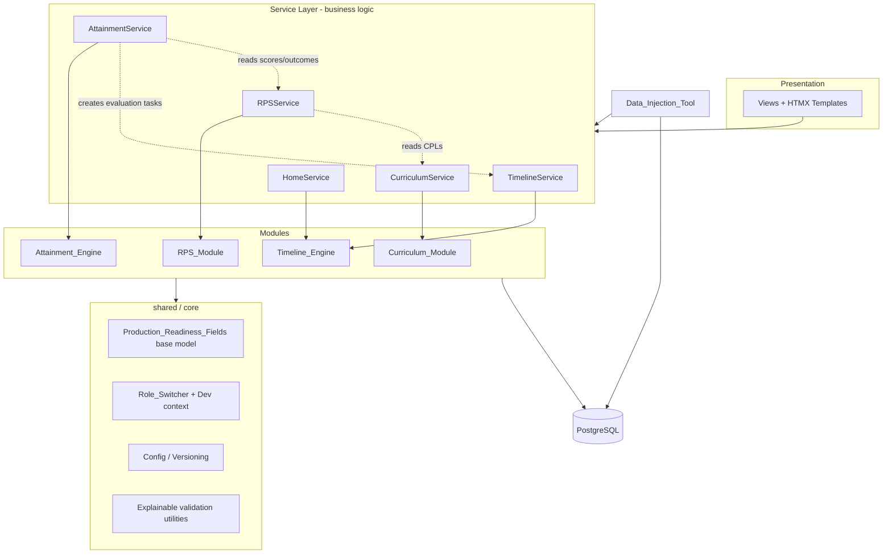
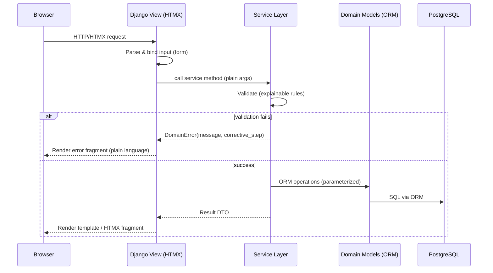
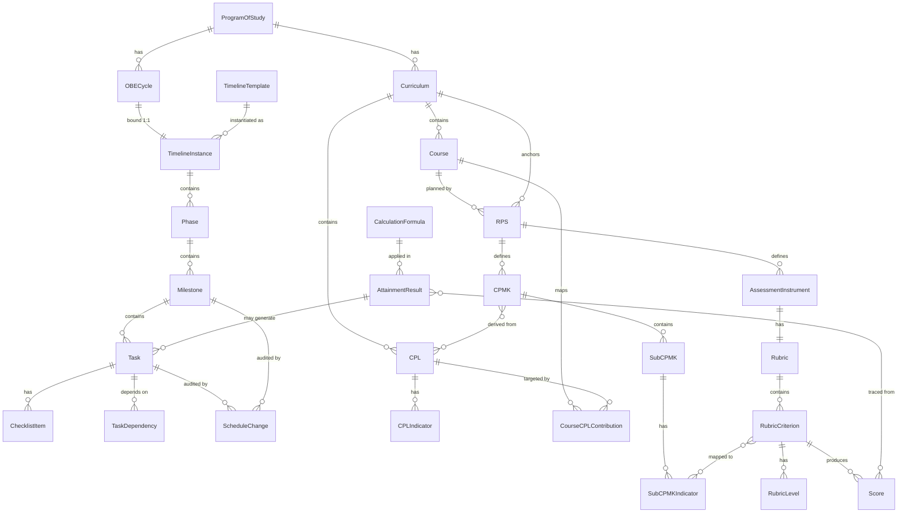
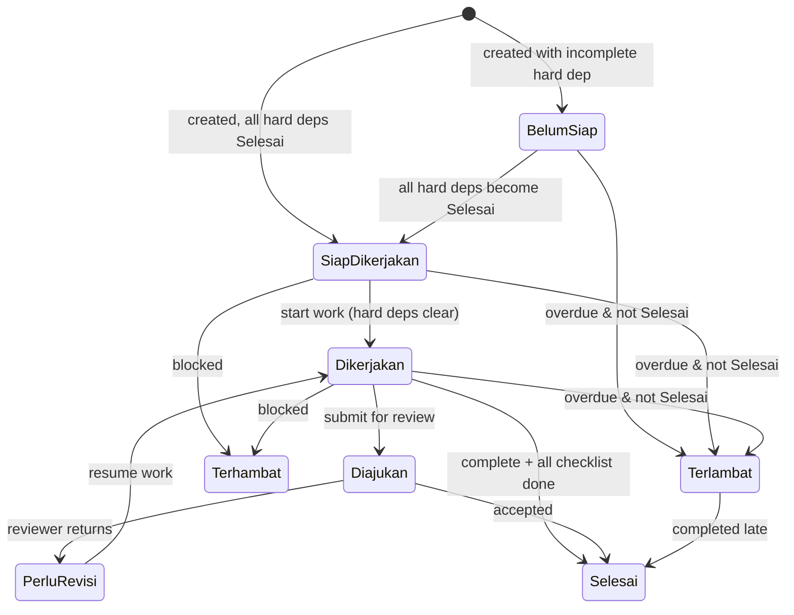
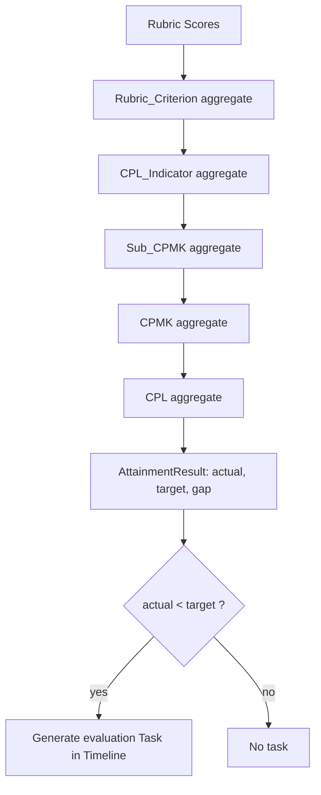
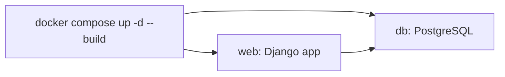

# Design Document

## Overview

The OBE_System is a **modular monolith** built with **Django** and **PostgreSQL**. It proves one complete Outcome-Based Education vertical loop: a Kaprodi instantiates an OBE Cycle from a timeline template; a Lecturer authors curriculum, RPS, and rubrics; rubric grading aggregates upward through named, versioned formulas into learning-outcome attainment; and attainment gaps automatically create follow-up evaluation tasks in the timeline.

The system is delivered as **server-rendered Django templates enhanced with HTMX** for partial updates and wizard interactions. A strict internal boundary separates **request-handling views** (HTTP concerns) from a **service layer** (business logic and orchestration), so a JSON API can be layered on later without touching the service layer. All persisted entities carry `Production_Readiness_Fields` so the development-only data model can be promoted to production without restructuring.

### Design Goals

- **Module boundaries first.** Five business modules plus shared/core, each owning its models, services, and validators. Cross-module calls go through service interfaces, never directly through another module's ORM models.
- **Thin views, fat services.** Views parse input, call one service method, and render a template or HTMX fragment. No business logic in views. This is the seam that makes a future JSON API a drop-in adapter.
- **Explainable everything.** Every generated task and every validation rejection returns plain-language guidance (problem + corrective step), with no database or internal-system terminology.
- **Extensibility without precommitment.** The design must not preclude a JSON API, GPM review workflow, student portal, or AI-assist features. Extension points are called out explicitly.

### Technology Choices

| Concern | Choice |
|---|---|
| Language / Framework | Python 3.12, Django 5.x |
| Database | PostgreSQL 16 |
| UI | Django Templates + HTMX (partial swaps, wizard autosave) |
| Schema management | Django migrations |
| Data loading | Django management commands + CSV/JSON importers |
| Deployment | Docker Compose (`web` + `db` containers) |
| Configuration | Versioned config records in the database |

---

## Architecture

### Module Structure

The system is one Django project composed of focused apps. Business modules never import each other's models directly; they collaborate through the service layer.



### Layered Request Flow

The seam between views and services is the core architectural rule (Requirement 18.4). Views are HTTP adapters; the service layer is transport-agnostic and reusable by a future JSON API.



The future JSON API is simply a second adapter (DRF viewset or plain JSON view) that calls the **same** service methods and serializes the same result DTOs. No service code changes.

### Workspaces (UI Structure)

Exactly five workspaces (Requirement 16.1), each screen presenting one decision:

| Workspace | Purpose |
|---|---|
| **Home** | Next-best-work: Do Now / Next / Waiting on Others |
| **Timeline** | OBE cycles, templates, instances, phases, milestones, tasks, dependencies, history |
| **Curriculum** | Curricula, CPLs, indicators, courses, course→CPL contributions |
| **Learning** | RPS authoring wizards, CPMK/Sub-CPMK, assessment instruments, rubrics |
| **Attainment & Quality** | Run calculations, view actual/target/gap, traceability, gap-driven tasks |

Multi-step authoring flows (curriculum setup, RPS authoring) are **wizards with autosave**: each step persists entered data through the service layer before the next step renders (Requirements 16.2, 16.3), with fields prefilled from the saved state on return.

---

## Data Model

### Production Readiness Fields (shared base)

Every persisted entity inherits an abstract base carrying the production-readiness metadata (Requirements 1.3, 6.3, 8.4, 9.4).

```python
class ProductionReadinessModel(models.Model):
    prodi = models.ForeignKey("core.ProgramOfStudy", on_delete=models.PROTECT)
    owner = models.ForeignKey("core.DemoUser", on_delete=models.PROTECT, related_name="+")
    status = models.CharField(max_length=32)          # lifecycle per entity type
    version = models.PositiveIntegerField(default=1)
    creator = models.ForeignKey("core.DemoUser", on_delete=models.PROTECT, related_name="+")
    created_time = models.DateTimeField(auto_now_add=True)
    modified_time = models.DateTimeField(auto_now=True)

    class Meta:
        abstract = True
```

All concrete entities below extend `ProductionReadinessModel`.

### Entity-Relationship Overview



### Key Entities and Fields

**Timeline_Engine**
- `TimelineTemplate` — reusable structure; `Phase/Milestone/Task/Checklist` template rows (or a template flag).
- `TimelineInstance` — bound to exactly one `OBECycle` (`OneToOneField`, Requirement 1.2).
- `Phase`, `Milestone`, `Task`, `ChecklistItem`.
- `Task` fields: `title`, `owner`, `status` (enum), `deadline_kind` (fixed|relative), `fixed_date`, `relative_offset_days`, `relative_reference` (FK to Milestone or Task), `resolved_deadline` (computed), plus explanation fields (`what`, `why`, `who`, `how`, `next`).
- `TaskDependency` — `predecessor`, `successor`, `kind` (hard|soft).
- `ScheduleChange` — non-destructive audit: `target` (milestone/task), `actor`, `timestamp`, `previous_value`, `new_value`, `reason` (Requirement 5).

**Curriculum_Module**
- `Curriculum` — `status` in {draft, active, archived} (Requirement 6.6). At most one active per prodi enforced by a service check plus a partial unique constraint.
- `CPL`, `CPLIndicator` (numeric `target_value`), `Course`.
- `CourseCPLContribution` — `course`, `cpl`, `contribution_level` in {Introduce, Reinforce, Master}.

**RPS_Module**
- `RPS` — FKs to exactly one `Course`, `Curriculum`, class, and academic period (Requirement 8.1).
- `CPMK` — M2M `derived_from` CPLs (constrained to the bound curriculum, Requirement 8.5).
- `SubCPMK`, `SubCPMKIndicator`.
- `AssessmentInstrument` — one `Rubric`.
- `Rubric`, `RubricCriterion` (`weight` percent), `RubricLevel` (`label`, `score`).
- `RubricCriterion.mapped_indicators` — M2M to `SubCPMKIndicator`.
- `Score` — a graded value for a `RubricCriterion` (per subject/student-proxy).

**Attainment_Engine**
- `CalculationFormula` — `name`, `version`, `level` (criterion/indicator/subcpmk/cpmk/cpl), `definition` (versioned config).
- `AttainmentResult` — `outcome_ref`, `actual_value`, `target_value`, `gap`, `formula_name`, `formula_version`, M2M traceability to source `Score` rows.

**Shared / core**
- `ProgramOfStudy`, `DemoUser` (role, no real auth), `ConfigRecord` (versioned rules/standards/formulas, Requirement 18.2), `DataInjectionLog`.

### Status Enumerations

```python
class TaskStatus(models.TextChoices):
    BELUM_SIAP = "belum_siap", "Belum Siap"
    SIAP_DIKERJAKAN = "siap_dikerjakan", "Siap Dikerjakan"
    DIKERJAKAN = "dikerjakan", "Dikerjakan"
    DIAJUKAN = "diajukan", "Diajukan"
    PERLU_REVISI = "perlu_revisi", "Perlu Revisi"
    SELESAI = "selesai", "Selesai"
    TERHAMBAT = "terhambat", "Terhambat"
    TERLAMBAT = "terlambat", "Terlambat"
```

---

## Components and Interfaces

The service layer is the public contract of each module. Views and the Data_Injection_Tool depend only on these interfaces. Signatures use plain arguments and return result DTOs / raise `DomainError`.

### TimelineService

```python
class TimelineService:
    def create_cycle_from_template(self, template_id, cycle_data, actor) -> CycleDTO:
        """Instantiate a full TimelineInstance (phases, milestones, tasks,
        checklists, dependencies) from a template and bind it to a new cycle.
        Rejects templates with no phase. (Req 1.1-1.5)"""

    def submit_task(self, task_id, actor) -> TaskDTO:            # -> Diajukan (Req 2.4)
    def return_task_for_revision(self, task_id, actor) -> TaskDTO:  # -> Perlu Revisi (Req 2.5)
    def complete_task(self, task_id, actor) -> TaskDTO:         # -> Selesai if checklist done (Req 2.7)
    def transition_to_dikerjakan(self, task_id, actor) -> TaskDTO:  # blocked by hard deps (Req 3.2)

    def recompute_statuses(self, instance_id) -> None:
        """Recompute derived statuses: Belum Siap / Siap Dikerjakan from hard
        deps (Req 2.2, 2.3), Terlambat from overdue (Req 2.6)."""

    def change_schedule(self, target_id, new_deadline, reason, actor) -> ScheduleChangeDTO:
        """Non-destructive: retains previous value + reason; recomputes
        dependent relative deadlines. (Req 3.5, 5.1-5.3)"""

    def get_history(self, instance_id) -> list[ScheduleChangeDTO]:  # reverse chronological (Req 5.4)
```

### HomeService

```python
class HomeService:
    def next_best_work(self, user) -> HomeGroupsDTO:
        """Partition the user's tasks into Do Now / Next / Waiting on Others by
        status, each with a full explanation. (Req 4.1-4.5)"""
```

### CurriculumService

```python
class CurriculumService:
    def create_curriculum(self, data, actor) -> CurriculumDTO:      # Req 6.1-6.3
    def activate_curriculum(self, curriculum_id, actor) -> CurriculumDTO:
        """Enforce at most one active curriculum per prodi; reject second
        activation with explainable message. (Req 6.4, 6.5)"""
    def map_course_to_cpl(self, course_id, cpl_id, level, actor) -> ContributionDTO:
        """Require contribution level in {Introduce, Reinforce, Master}. (Req 7.1, 7.4)"""
```

### RPSService

```python
class RPSService:
    def create_rps(self, course_id, curriculum_id, class_id, period_id, actor) -> RPSDTO:  # Req 8.1
    def add_cpmk(self, rps_id, cpl_ids, data, actor) -> CPMKDTO:
        """Derive CPMK only from CPLs of the bound curriculum. (Req 8.2, 8.5)"""
    def define_rubric(self, instrument_id, criteria, actor) -> RubricDTO:  # Req 9.1-9.3
    def submit_rps(self, rps_id, actor) -> RPSDTO:
        """Validate weight-sum == 100% and full indicator coverage before
        submission; block with explainable messages. (Req 10.1-10.4)"""
```

### AttainmentService

```python
class AttainmentService:
    def calculate(self, cycle_id, actor) -> AttainmentRunDTO:
        """Aggregate Rubric_Criterion -> CPL_Indicator -> Sub_CPMK -> CPMK -> CPL
        using named/versioned formulas; store actual/target/gap + traceability.
        Halt on missing/out-of-range data leaving prior results unchanged.
        Generate gap-driven evaluation tasks via TimelineService.
        (Req 11, 12, 13)"""
```

### Cross-Module Collaboration Rules

- `AttainmentService` reads scores/outcomes via `RPSService` and creates evaluation tasks via `TimelineService` — never by importing another module's models.
- `RPSService` reads CPLs via `CurriculumService` for derivation validation.
- All writes flow through the owning module's service, keeping module boundaries clean and JSON-API-ready.

---

## Timeline Engine Design

### Template → Instance Instantiation

`create_cycle_from_template` performs a deep copy within a single transaction: every Phase, Milestone, Task, Checklist item, and dependency edge in the template is reproduced in the instance, preserving hierarchy and remapping dependency references from template tasks to their newly created instance counterparts (Requirements 1.1, 1.4). If the template has zero phases, the service raises a `DomainError` naming the missing structure and the corrective step before any write (Requirement 1.5).

### Task Status State Machine



- **Derived vs. actioned statuses.** `Belum Siap`, `Siap Dikerjakan`, and `Terlambat` are *derived* by `recompute_statuses` from dependency completion and the current date (Requirements 2.2, 2.3, 2.6). `Diajukan`, `Perlu Revisi`, and `Selesai` result from explicit user actions (Requirements 2.4, 2.5, 2.7). All values are constrained to the eight-member enum (Requirement 2.1).
- **Hard vs. soft dependencies.** A hard dependency blocks the successor from entering `Dikerjakan` until the predecessor is `Selesai` (Requirements 3.1, 3.2). A soft dependency never blocks; instead the service surfaces an advisory naming the incomplete predecessor (Requirement 3.3).

### Deadlines: Fixed vs. Relative

Each task deadline is either a `Fixed_Date` or a `Relative_Date` (offset + reference) (Requirement 3.4). `resolved_deadline` is computed from the reference. When a referenced milestone/task date changes, `change_schedule` recomputes the resolved deadline of every dependent relative-dated task (Requirement 3.5).

### Non-Destructive History

Schedule changes never overwrite: `change_schedule` writes a `ScheduleChange` row capturing actor, timestamp, previous value, new value, and a required reason (Requirements 5.1–5.3). `get_history` returns entries newest-first (Requirement 5.4).

### Home Grouping (Next Best Work)

`HomeService.next_best_work` partitions the current user's tasks:

| Status | Group |
|---|---|
| Siap Dikerjakan, Dikerjakan | Do Now |
| Belum Siap | Next |
| Diajukan | Waiting on Others |

Each task carries a full plain-language explanation (what/why/who/when/how/next) (Requirements 4.1–4.5).

---

## Curriculum and RPS Design

### Single Active Curriculum Enforcement

`activate_curriculum` checks for an existing active curriculum in the same prodi. If found, it rejects with a message naming the existing active curriculum and the corrective step (Requirements 6.4, 6.5). A PostgreSQL partial unique index (`UNIQUE (prodi) WHERE status='active'`) provides a defense-in-depth guarantee at the database level.

### Course → CPL Contribution

Mapping requires a contribution level from {Introduce, Reinforce, Master}; any other value is rejected with the allowed values listed (Requirements 7.1, 7.4). The relationship is many-to-many (Requirements 7.2, 7.3).

### RPS Authoring and Rubric Validation

RPS binds to exactly one course/curriculum/class/period (Requirement 8.1). CPMKs may derive only from CPLs of the bound curriculum; a foreign CPL is rejected with an explainable message (Requirements 8.2, 8.5). On `submit_rps`, two validations run before the RPS advances:

1. **Weight sum.** Each rubric's criterion weights must sum to 100%. Otherwise submission is blocked with a message stating the current sum and the required sum (Requirements 10.1, 10.3).
2. **Coverage.** Every Sub_CPMK indicator must map to at least one rubric criterion. Otherwise submission is blocked with a message listing each unmapped indicator and the corrective step (Requirements 10.2, 10.4).

---

## Attainment Engine Design

### Aggregation Chain



At each level a named, versioned `CalculationFormula` is applied, and its name and version are recorded on each `AttainmentResult` (Requirements 11.1, 11.2). Each result stores `actual_value`, `target_value`, and `gap = actual − target`, with traceability back to the contributing rubric scores (Requirements 11.3, 11.4).

### Data-Integrity Halt

Before aggregating, the engine validates source data. If any required score is missing, or a score falls outside its criterion's defined range, the engine **halts** and returns a message identifying the offending data and the corrective step (Requirements 12.1, 12.2). The entire run executes in a transaction so that a halt leaves all existing `AttainmentResult` rows unchanged (Requirement 12.3).

### Gap-Driven Evaluation Tasks

For each result where `actual < target`, the engine calls `TimelineService` to create an evaluation task in the cycle's timeline instance, populated with an explanation naming the outcome, actual value, target value, and gap (Requirements 13.1, 13.2). No task is created when `actual ≥ target` (Requirement 13.3).

---

## Error and Validation Handling

### Explainable Validation

All validation raises a `DomainError` carrying a plain-language `message` and `corrective_step`. A shared validation utility formats messages so they:

- state the **problem** and the **corrective step** (Requirement 14.2),
- avoid database/internal terminology (no "foreign key", "constraint", "null", table names) (Requirement 14.3),
- are rendered by views as inline HTMX error fragments.

```python
class DomainError(Exception):
    def __init__(self, message: str, corrective_step: str):
        self.message = message
        self.corrective_step = corrective_step
```

A jargon blocklist is applied in tests to guarantee messages stay plain-language.

### Explanation Completeness

Generated tasks (template-instantiated and gap-driven) and Home task cards all carry the six explanation facets — what, why, who, when, how, and what follows (Requirements 4.5, 13.2, 14.1).

---

## Development Environment

- **Demo accounts** for Kaprodi and Lecturer roles, seeded by the Data_Injection_Tool (Requirement 15.1).
- **Role_Switcher**: an in-app control that swaps the active `DemoUser`/role in session; the interface and available actions reflect the selected role (Requirement 15.2). No real authentication, SSO, or permission enforcement (Requirement 15.4).
- **Dev_Banner**: a persistent banner stating the environment is development with synthetic data, rendered in the base template (Requirement 15.3).

Extension point: the role/session abstraction is isolated so real authentication and permission enforcement can replace it without touching service logic.

---

## Data Injection, Schema, and Deployment

### Data_Injection_Tool

- Official Django **management commands** and **CSV/JSON importers** load synthetic data (Requirement 17.1).
- Loads are **idempotent**: keyed upserts through the ORM ensure a repeated run yields an identical data set (Requirement 17.2).
- Every load/reset writes a `DataInjectionLog` record (Requirement 17.3).
- All database access uses the Django ORM with parameterized queries — **no string-concatenated SQL** (Requirement 17.4).

### Schema and Configuration

- All schema changes are applied through **Django migrations**, never seed scripts (Requirement 18.1).
- Standards, `CalculationFormula` definitions, and validation rules are stored as **versioned configuration records** (Requirement 18.2), enabling reproducible, auditable calculations.

### Deployment

`docker compose up -d --build` starts a **web** container (Django) and a **db** container (PostgreSQL) (Requirement 18.3).



### Future Extensibility (must not be precluded)

- **JSON API**: a new adapter over the existing service layer (Requirement 18.4).
- **GPM review**: a new review state/workflow atop the timeline and RPS submission flow.
- **Student portal**: read-oriented views over existing outcome/attainment data.
- **AI-assist**: services can be wrapped by AI helpers without changing signatures.

---

## Correctness Properties

*A property is a characteristic or behavior that should hold true across all valid executions of a system — essentially, a formal statement about what the system should do. Properties serve as the bridge between human-readable specifications and machine-verifiable correctness guarantees.*

### Property 1: Instantiation preserves template structure

For any Timeline_Template containing at least one Phase, creating an OBE_Cycle from it produces a Timeline_Instance whose set of Phases, Milestones, Tasks, and Checklist items matches the template's, including every copied dependency edge.

**Validates: Requirements 1.1, 1.4**

### Property 2: Each instance binds to exactly one cycle

For any Timeline_Instance, it references exactly one OBE_Cycle.

**Validates: Requirements 1.2**

### Property 3: Production-readiness fields are always populated

For any created OBE_Cycle, Curriculum, CPL, Course, RPS, Assessment_Instrument, or Rubric, all seven Production_Readiness_Fields (prodi, owner, status, version, creator, created_time, modified_time) are populated.

**Validates: Requirements 1.3, 6.3, 8.4, 9.4**

### Property 4: Task status is always a valid enum value

For any Task at any point in its lifecycle, its Task_Status is one of the eight allowed values.

**Validates: Requirements 2.1**

### Property 5: Belum Siap while a hard dependency is incomplete

For any Task with at least one Hard_Dependency not yet Selesai, its status is Belum Siap.

**Validates: Requirements 2.2**

### Property 6: Siap Dikerjakan when all hard dependencies complete

For any Task whose every Hard_Dependency has reached Selesai, its status becomes Siap Dikerjakan.

**Validates: Requirements 2.3**

### Property 7: Overdue incomplete tasks become Terlambat

For any Task whose resolved deadline is earlier than the current date and whose status is not Selesai, its status becomes Terlambat.

**Validates: Requirements 2.6**

### Property 8: Selesai only when marked complete and all checklist items complete

For any Task, it reaches Selesai if and only if it is marked complete and every one of its Checklist items is complete.

**Validates: Requirements 2.7**

### Property 9: Hard dependencies block Dikerjakan

For any Task with an incomplete Hard_Dependency, an attempt to move it to Dikerjakan is prevented.

**Validates: Requirements 3.2**

### Property 10: Soft dependencies advise but never block

For any Task with an incomplete Soft_Dependency, work on the Task is allowed and an advisory naming the incomplete predecessor is presented.

**Validates: Requirements 3.3**

### Property 11: Relative deadlines track their reference

For any Task with a Relative_Date, shifting the reference date by a delta shifts the Task's resolved deadline by the same delta.

**Validates: Requirements 3.5**

### Property 12: Home grouping maps status to the correct bucket

For any set of Tasks assigned to a user, each Task is placed in exactly one Home group according to: Siap Dikerjakan/Dikerjakan → Do Now, Belum Siap → Next, Diajukan → Waiting on Others.

**Validates: Requirements 4.1, 4.2, 4.3, 4.4**

### Property 13: Explanations are complete

For any Task presented in Home or generated by the system (template or gap-driven), its explanation includes what it is, why it matters, who owns it, when it is due, how to complete it, and what follows.

**Validates: Requirements 4.5, 13.2, 14.1**

### Property 14: Schedule history is non-destructive and ordered

For any sequence of schedule changes to a Milestone or Task, every previous deadline is retained with its actor, timestamp, previous value, new value, and reason, and the history is returned in reverse chronological order.

**Validates: Requirements 5.1, 5.2, 5.3, 5.4**

### Property 15: At most one active curriculum per prodi

For any sequence of curriculum activations within a program of study, at most one Curriculum is active at any time, and any attempt to activate a second is rejected with a message naming the existing active Curriculum and the corrective step.

**Validates: Requirements 6.4, 6.5**

### Property 16: Curriculum status stays within its lifecycle

For any Curriculum, its status is always one of draft, active, or archived.

**Validates: Requirements 6.6**

### Property 17: Contribution level is constrained

For any Course-to-CPL mapping, the Contribution_Level is one of Introduce, Reinforce, or Master, and any other value is rejected with the allowed values listed.

**Validates: Requirements 7.1, 7.4**

### Property 18: CPMK derives only from bound-curriculum CPLs

For any CPMK created within an RPS, every CPL it derives from belongs to the RPS's bound Curriculum; a derivation from a foreign CPL is rejected with an explainable message.

**Validates: Requirements 8.2, 8.5**

### Property 19: RPS submission requires weights summing to 100%

For any RPS, submission succeeds only if every Rubric's criterion weights sum to 100%; otherwise it is blocked with a message stating the current sum and the required sum.

**Validates: Requirements 10.1, 10.3**

### Property 20: RPS submission requires full indicator coverage

For any RPS, submission succeeds only if every Sub_CPMK indicator maps to at least one Rubric_Criterion; otherwise it is blocked with a message identifying each unmapped indicator and the corrective step.

**Validates: Requirements 10.2, 10.4**

### Property 21: Attainment results record formula identity and correct gap

For any Attainment_Result produced by a calculation, it records the name and version of the Calculation_Formula applied, and its gap equals its actual value minus its target value.

**Validates: Requirements 11.2, 11.3**

### Property 22: Attainment results are traceable to source scores

For any Attainment_Result, it retains a link to the rubric scores that produced it, along the chain Rubric_Criterion → CPL_Indicator → Sub_CPMK → CPMK → CPL.

**Validates: Requirements 11.1, 11.4**

### Property 23: Bad data halts calculation without side effects

For any calculation run where a required score is missing or a score is out of range, the engine halts, returns a message identifying the offending data and corrective step, and leaves all existing Attainment_Results unchanged.

**Validates: Requirements 12.1, 12.2, 12.3**

### Property 24: Evaluation tasks are created exactly for unmet outcomes

For any Attainment_Result, an evaluation Task is generated in the cycle's Timeline_Instance if and only if the actual value is below the target value.

**Validates: Requirements 13.1, 13.3**

### Property 25: Validation messages are plain-language and actionable

For any validation rejection, the returned message states the problem and a corrective step and contains no database or internal-system terminology.

**Validates: Requirements 14.2, 14.3**

### Property 26: Wizard steps persist before advancing

For any wizard step advanced with entered data, the data is persisted through the service layer before the next step is presented (and prefilled on return).

**Validates: Requirements 16.2, 16.3**

### Property 27: Data injection is idempotent

For any input data set, running a load command twice leaves the resulting data set identical to running it once.

**Validates: Requirements 17.2**

---

## Testing Strategy

The system uses a **dual testing approach**: property-based tests for universal behaviors and example/edge/integration tests for specific scenarios and infrastructure.

### Property-Based Tests

- Implemented with **Hypothesis** against the service layer (pure logic, using an in-memory/transactional test database).
- Minimum **100 iterations** per property test.
- Each property test is tagged: **Feature: obe-system, Property {number}: {property_text}** and references the design property it validates.
- Generators produce random timeline templates, dependency graphs, task/checklist states, curricula, rubric weight sets, indicator-coverage maps, and attainment score trees. Generators deliberately include edge cases: empty structures, all-whitespace strings, out-of-range scores, missing scores, non-ASCII text, and boundary weight sums (99/100/101).
- Properties 1–27 map to the test suite above.

### Example-Based Unit Tests

- Deterministic transitions: submit → Diajukan (2.4), return → Perlu Revisi (2.5).
- Structural cardinality: curriculum→CPL→indicator (6.1), CPMK→Sub_CPMK→indicators (8.3), instrument→rubric (9.1), many-to-many course↔CPL (7.2, 7.3).
- Role switch changes available actions (15.2).
- Exactly five workspaces (16.1).
- Data injection writes a log record (17.3).

### Edge-Case Tests

- Reject template with no phase (1.5).
- Reject invalid contribution level (7.4).
- Reject CPMK from foreign CPL (8.5).
- Halt on missing/out-of-range score (12.1, 12.2).

### Integration and Smoke Tests

- `docker compose up -d --build` starts web + db containers and the app connects to the database (18.3) — integration test with 1–2 runs.
- Demo accounts seeded (15.1), Dev_Banner present (15.3), no auth enforcement (15.4) — smoke checks.
- Migrations present and schema applied via migrations, not seed scripts (18.1) — smoke check.
- ORM/parameterized-query usage; no string-concatenated SQL (17.4) — static inspection.
- Views contain no business logic and call services (18.4) — structural inspection.

### Test Data and Isolation

- Property tests run against a transactional test database; each example runs in a rolled-back transaction to keep runs independent.
- Attainment calculations are tested with generated score trees and mock formula definitions so aggregation logic is validated independently of specific formula content.
