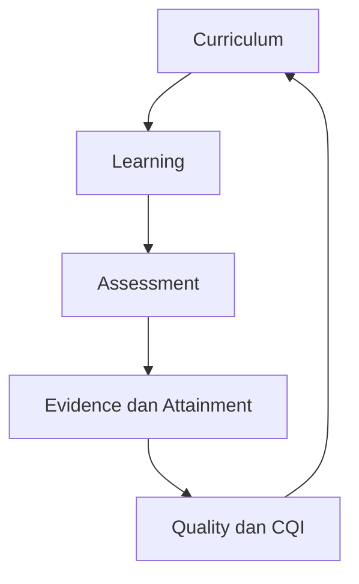

# OBE Apps

Platform OBE yang ringkas untuk menghubungkan **kurikulum → RPS → asesmen → bukti → capaian → CQI**. Aplikasi memakai Django + DRF, HTMX, Tailwind CSS, PostgreSQL, Valkey, RabbitMQ/Celery, dan Apache ECharts yang di-host lokal.

Sumber kebutuhan normatif adalah `Spesifikasi_Utama_Pengembangan_OBE_Apps_PR-01-PR-88.md` dengan SHA-256 `f404527ecfd3b81000e8fcb640a469147c60d0308ef2930fdbe3811eae610be2`. Kebutuhan di luar dokumen tersebut wajib diajukan melalui PR baru. Bukti implementasi per requirement dicatat di [traceability](docs/TRACEABILITY.md).

## Instalasi tercepat

Prasyarat: Docker dan Docker Compose.

```bash
./scripts/setup-local.sh
docker compose up --build
```

Buka <http://localhost:8000>. Data demo dibuat otomatis.

| Peran | Username |
|---|---|
| Prodi | `prodi` |
| GPM | `gpm` |
| Pengampu | `pengampu` |
| Mahasiswa | `mahasiswa` |

Password acak ditampilkan sekali oleh `setup-local.sh` dan tersimpan di `.env` privat. Seed demo otomatis ditolak saat mode production/non-debug.

Untuk menghentikan aplikasi:

```bash
docker compose down
```

Data tetap tersimpan di Docker volumes. Gunakan `docker compose down -v` hanya jika memang ingin menghapus seluruh data lokal.

## Perintah sehari-hari

```bash
# Lihat log
docker compose logs -f web worker

# Buat admin lokal
docker compose exec web python manage.py createsuperuser

# Jalankan test
docker compose exec web pytest

# Periksa migration
docker compose exec web python manage.py makemigrations --check --dry-run

# Masuk shell Django
docker compose exec web python manage.py shell
```

## Menjalankan tanpa Docker

```bash
python -m venv .venv
. .venv/bin/activate
pip install -e '.[dev]'
./scripts/setup-local.sh
npm ci && npm run build
python manage.py migrate
python manage.py seed_demo
python manage.py runserver
```

SQLite dipakai otomatis untuk pengembangan cepat; PostgreSQL tetap menjadi sumber kebenaran pada deployment Compose.

## Struktur singkat

```text
config/                     konfigurasi local/test/production/exam-edge
obe/
  shared/                   audit, outbox, feature flag, rules, file manifest
  identity/                 RBAC dan scoped assignment
  curriculum/               versi kurikulum, PL/CPL/BK/CPMK, 77 mata kuliah
  learning/                 offering, RPS, 16 minggu, kehadiran
  assessment/               instrumen, submission, nilai, attainment
  evidence/                 bukti immutable content-addressed
  analytics/                Semantic JSON + ECharts lokal
  quality/                  integrity issue, PPEPP, CQI
  ai/                       satu gateway LiteLLM dan AI kill switch
  secure_exam/              authoring, sesi, autosave, signed bundle
  academic_lifecycle/       status, IRS, hasil studi, task, notifikasi
  integration/              staging, validasi, rekonsiliasi
deploy/                     Nginx, Ansible, observability, SOPS, Exam Edge
docs/                       arsitektur, operasi, API, dan traceability PR-01–PR-88
tests/                      unit, contract, security, dan architecture tests
```

Impor model lintas domain dilarang. Modul berkomunikasi melalui `services`, `selectors`, command, atau domain event di transactional outbox. Jalankan `python tests/test_architecture.py` untuk memverifikasi batas ini.

Dependency graph kanonik bersifat searah:



Siklus pada gambar adalah siklus proses bisnis, bukan dependency impor Python. Semua domain hanya boleh bergantung pada shared kernel atau kontrak `service`, `selector`, `command`, dan domain event. Architecture test membangun graph impor aktual dan menggagalkan circular dependency, direct cross-domain model access, serta akses AI di luar `obe.ai.gateway`.

Perubahan schema/API wajib mengikuti aturan berikut:

- Migration harus deterministik; `RunPython` dan `RunSQL` wajib memiliki operasi balik atau forward-fix plan yang disetujui.
- API publik dan event contract harus versioned, backward-compatible selama masa transisi, serta memiliki contract test.
- Perubahan breaking memakai endpoint/event version baru, migration plan, dampak data, feature flag, dan rollback pada deskripsi PR.
- Modul baru dimulai dari [template modul](docs/module-template/README.md) agar URL, permission, service, API, migration, test, audit, dan feature flag tersedia sejak awal.

## Quality gate

```bash
./scripts/check.sh
```

Gate mencakup Ruff, format, migration drift, unit/integration/contract tests, architecture test, dependency/secret scan, dan SBOM di CI. Baseline saat ini memiliki 41 test dan coverage 90%.

## Dokumentasi

- [Arsitektur](docs/ARCHITECTURE.md)
- [Kontrak API](docs/API.md)
- [Operasi, backup, dan restore](docs/OPERATIONS.md)
- [Keamanan](docs/SECURITY.md)
- [Traceability PR-01–PR-88](docs/TRACEABILITY.md)
- [Status implementasi dan release gate](docs/IMPLEMENTATION_STATUS.md)
- [Tata kelola CI dan branch](docs/CI_GOVERNANCE.md)
- [Audit penerimaan PR-01–PR-03](docs/PR01_PR03_ACCEPTANCE.md)

## Catatan ruang lingkup

PR ini adalah baseline aplikasi yang runnable dan fondasi production-oriented. Sign-off UAT, benchmark kapasitas server/lab, hardening jaringan aktual, backup-restore rehearsal, dan go-live tujuh hari tetap harus dijalankan pada lingkungan institusi sebelum status production-ready diberikan.
