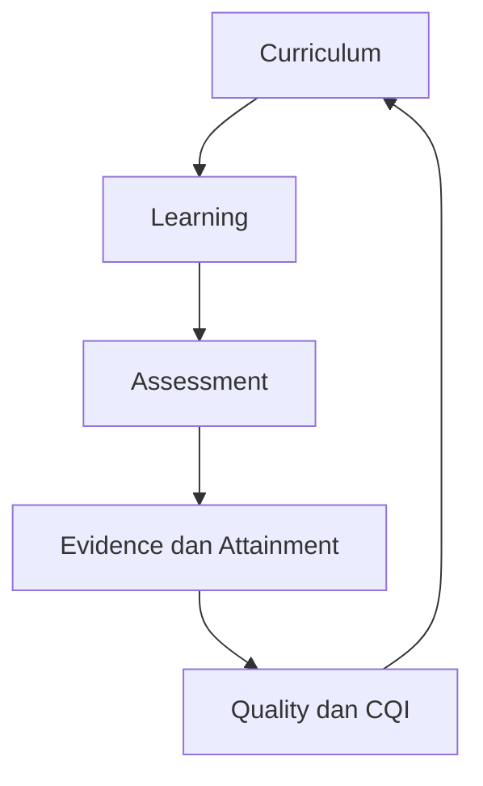

# OBE Apps

Platform OBE yang ringkas untuk menghubungkan **kurikulum → RPS → asesmen → bukti → capaian → CQI**. Aplikasi memakai Django + DRF, HTMX, Tailwind CSS, PostgreSQL, Valkey, RabbitMQ/Celery, dan Apache ECharts yang di-host lokal.

Sumber kebutuhan normatif adalah `Spesifikasi_Utama_Pengembangan_OBE_Apps_PR-01-PR-88.md` dengan SHA-256 `f404527ecfd3b81000e8fcb640a469147c60d0308ef2930fdbe3811eae610be2`. Kebutuhan di luar dokumen tersebut wajib diajukan melalui PR baru. Bukti implementasi per requirement dicatat di [traceability](docs/TRACEABILITY.md).

## Instalasi tercepat

Prasyarat: Docker dan Docker Compose.

```bash
./scripts/setup-local.sh
docker compose up --build
```

Buka <http://localhost:8000>. Data demo dibuat otomatis.

| Peran | Username |
|---|---|
| Prodi | `prodi` |
| GPM | `gpm` |
| Pengampu | `pengampu` |
| Mahasiswa | `mahasiswa` |

Password acak ditampilkan sekali oleh `setup-local.sh` dan tersimpan di `.env` privat. Seed demo otomatis ditolak saat mode production/non-debug.

Data demo memakai normalisasi aman `sample-data-2020-2026-obe-spec-v5`: 5 PL, 12 CPL, 18 bahan kajian, 31 CPMK, 77 mata kuliah, 2 package cohort, 11 academic rule, pemetaan kurikulum, agregat capaian, dan empat riwayat mahasiswa sintetis. Detail provenance serta pemetaan model tersedia di [panduan dataset v5](docs/DATASET_V5.md).

Untuk menghentikan aplikasi:

```bash
docker compose down
```

Data tetap tersimpan di Docker volumes. Gunakan `docker compose down -v` hanya jika memang ingin menghapus seluruh data lokal.

## Perintah sehari-hari

```bash
# Lihat log
docker compose logs -f web worker

# Buat admin lokal
docker compose exec web python manage.py createsuperuser

# Jalankan test
docker compose exec web pytest

# Periksa migration
docker compose exec web python manage.py makemigrations --check --dry-run

# Masuk shell Django
docker compose exec web python manage.py shell

# Impor ulang dataset v5 secara idempotent
docker compose exec web python manage.py import_obe_sample
```

## Menjalankan tanpa Docker

```bash
python -m venv .venv
. .venv/bin/activate
pip install -e '.[dev]'
./scripts/setup-local.sh
npm ci && npm run build
python manage.py migrate
python manage.py seed_demo
python manage.py runserver
```

SQLite dipakai otomatis untuk pengembangan cepat; PostgreSQL tetap menjadi sumber kebenaran pada deployment Compose.

## Lingkungan dan secret

Profil `local`, `test`, `staging`, `production`, dan `exam-edge` terpisah serta divalidasi saat startup. Deployment terkelola menggunakan SOPS dan file runtime `*_FILE`; plaintext secret tidak disimpan di repositori.

- Mulai dari template di [`deploy/env`](deploy/env/).
- Ikuti [runbook secret dan rotasi](docs/SECRETS_RUNBOOK.md).
- Audit pemenuhan PR-04 tersedia di [penerimaan PR-04](docs/PR04_ACCEPTANCE.md).

Deployment production memakai compose terpisah dengan image digest immutable dan Ansible. Lihat [runbook deployment](docs/DEPLOYMENT_RUNBOOK.md); operasi sehari-hari tersedia melalui `python -m scripts.obe_ops`.

Pekerjaan asinkron memakai antrean bounded dan worker terisolasi; perubahan domain diteruskan melalui outbox/inbox idempoten dan ditelusuri menggunakan correlation ID. Lihat [runbook antrean](docs/QUEUE_RUNBOOK.md), [domain event](docs/EVENTS_RUNBOOK.md), dan [observability](docs/OBSERVABILITY_RUNBOOK.md).

Keamanan berlapis memakai rate limit per endpoint/aktor, scoped permission tunggal, account lock/MFA opsional, audit hash-chain append-only, serta feature flag dan kill switch berversi. Keputusan akademik memakai rule/package immutable, snapshot replay, override terpisah, dan gate integritas data; lihat [runbook aturan akademik](docs/ACADEMIC_RULES_RUNBOOK.md) dan [runbook integritas data](docs/DATA_INTEGRITY_RUNBOOK.md).

Kurikulum memakai lifecycle maker-reviewer-approver-activator, paket JSON/CSV ber-checksum, clone/diff/rollback, serta weighted trace PL→CPL→BK→mata kuliah→CPMK. Lihat [runbook kurikulum](docs/CURRICULUM_RUNBOOK.md) dan [penerimaan PR-19–PR-24](docs/PR19_PR24_ACCEPTANCE.md). Dataset demo sengaja tetap `review` karena 129 SKS wajib dan CPMK22/CPMK27 belum memiliki mapping sumber.

## Tutorial berdasarkan aktor

| Aktor | Fitur utama | Panduan |
|---|---|---|
| Prodi | versi rule/package, aktivasi maker-checker, override | [Tutorial Prodi](docs/tutorials/prodi.md) |
| GPM | review rule, integrity issue, verifikasi dan banding | [Tutorial GPM](docs/tutorials/gpm.md) |
| Pengampu | evidence row, explanation, koreksi dan pengajuan override | [Tutorial Pengampu](docs/tutorials/pengampu.md) |
| Mahasiswa | keputusan pribadi, explanation dan banding | [Tutorial Mahasiswa](docs/tutorials/mahasiswa.md) |

Fungsi DPA, koordinator, pembimbing, penguji, mentor, dan TPMF dijalankan sebagai assignment terbatas dari peran utama. Lihat [indeks tutorial aktor](docs/tutorials/README.md) untuk batas scope-nya.

## Struktur singkat

```text
config/                     konfigurasi local/test/staging/production/exam-edge
obe/
  shared/                   audit, outbox, feature flag, rules, file manifest
  identity/                 RBAC dan scoped assignment
  curriculum/               versi kurikulum, PL/CPL/BK/CPMK, 77 mata kuliah
  learning/                 offering, RPS, 16 minggu, kehadiran
  assessment/               instrumen, submission, nilai, attainment
  evidence/                 bukti immutable content-addressed
  analytics/                Semantic JSON + ECharts lokal
  quality/                  integrity issue, PPEPP, CQI
  ai/                       satu gateway LiteLLM dan AI kill switch
  secure_exam/              authoring, sesi, autosave, signed bundle
  academic_lifecycle/       status, IRS, hasil studi, task, notifikasi
  integration/              staging, validasi, rekonsiliasi
deploy/                     Nginx, Ansible, observability, SOPS, Exam Edge
docs/                       arsitektur, operasi, API, dan traceability PR-01–PR-88
tests/                      unit, contract, security, dan architecture tests
```

Impor model lintas domain dilarang. Modul berkomunikasi melalui `services`, `selectors`, command, atau domain event di transactional outbox. Jalankan `python tests/test_architecture.py` untuk memverifikasi batas ini.

Dependency graph kanonik bersifat searah:



Siklus pada gambar adalah siklus proses bisnis, bukan dependency impor Python. Semua domain hanya boleh bergantung pada shared kernel atau kontrak `service`, `selector`, `command`, dan domain event. Architecture test membangun graph impor aktual dan menggagalkan circular dependency, direct cross-domain model access, serta akses AI di luar `obe.ai.gateway`.

Perubahan schema/API wajib mengikuti aturan berikut:

- Migration harus deterministik; `RunPython` dan `RunSQL` wajib memiliki operasi balik atau forward-fix plan yang disetujui.
- API publik dan event contract harus versioned, backward-compatible selama masa transisi, serta memiliki contract test.
- Perubahan breaking memakai endpoint/event version baru, migration plan, dampak data, feature flag, dan rollback pada deskripsi PR.
- Modul baru dimulai dari [template modul](docs/module-template/README.md) agar URL, permission, service, API, migration, test, audit, dan feature flag tersedia sejak awal.

## Quality gate

```bash
./scripts/check.sh
```

Gate mencakup Ruff, format, migration drift, unit/integration/contract tests, architecture test, dependency/secret scan, dan SBOM di CI. Baseline saat ini memiliki 122 test dengan coverage minimum 85% dan gate tambahan per domain kritis, termasuk curriculum, evidence, identity, dan shared decision engine.

## Dokumentasi

- [Arsitektur](docs/ARCHITECTURE.md)
- [Kontrak API](docs/API.md)
- [Operasi, backup, dan restore](docs/OPERATIONS.md)
- [Keamanan](docs/SECURITY.md)
- [Baseline keamanan aplikasi dan jaringan](docs/SECURITY_RUNBOOK.md)
- [Identity, RBAC, dan scoped assignment](docs/IDENTITY_RUNBOOK.md)
- [Audit append-only dan signed export](docs/AUDIT_RUNBOOK.md)
- [Feature flag dan kill switch](docs/FEATURE_FLAG_RUNBOOK.md)
- [Aturan, package cohort, decision, override, dan banding](docs/ACADEMIC_RULES_RUNBOOK.md)
- [Validasi dan gate integritas data akademik](docs/DATA_INTEGRITY_RUNBOOK.md)
- [Lifecycle, paket, dan traceability kurikulum](docs/CURRICULUM_RUNBOOK.md)
- [Lingkungan, SOPS, rotasi, dan revokasi secret](docs/SECRETS_RUNBOOK.md)
- [Deployment reproducible](docs/DEPLOYMENT_RUNBOOK.md)
- [PostgreSQL dan concurrency](docs/DATABASE_RUNBOOK.md)
- [Evidence immutable](docs/EVIDENCE_RUNBOOK.md)
- [Valkey, RabbitMQ, dan worker Celery](docs/QUEUE_RUNBOOK.md)
- [Transactional outbox dan domain event](docs/EVENTS_RUNBOOK.md)
- [OpenTelemetry, dashboard, SLO, dan alert](docs/OBSERVABILITY_RUNBOOK.md)
- [Traceability PR-01–PR-88](docs/TRACEABILITY.md)
- [Status implementasi dan release gate](docs/IMPLEMENTATION_STATUS.md)
- [Tata kelola CI dan branch](docs/CI_GOVERNANCE.md)
- [Audit penerimaan PR-01–PR-03](docs/PR01_PR03_ACCEPTANCE.md)
- [Audit penerimaan PR-04](docs/PR04_ACCEPTANCE.md)
- [Audit penerimaan PR-05–PR-07](docs/PR05_PR07_ACCEPTANCE.md)
- [Audit penerimaan PR-08–PR-10](docs/PR08_PR10_ACCEPTANCE.md)
- [Audit penerimaan PR-11–PR-14](docs/PR11_PR14_ACCEPTANCE.md)
- [Audit penerimaan PR-15–PR-18](docs/PR15_PR18_ACCEPTANCE.md)
- [Audit penerimaan PR-19–PR-24](docs/PR19_PR24_ACCEPTANCE.md)
- [Dataset sintetis v5](docs/DATASET_V5.md)
- [Tutorial seluruh aktor](docs/tutorials/README.md)

## Catatan ruang lingkup

PR ini adalah baseline aplikasi yang runnable dan fondasi production-oriented. Sign-off UAT, benchmark kapasitas server/lab, hardening jaringan aktual, backup-restore rehearsal, dan go-live tujuh hari tetap harus dijalankan pada lingkungan institusi sebelum status production-ready diberikan.
