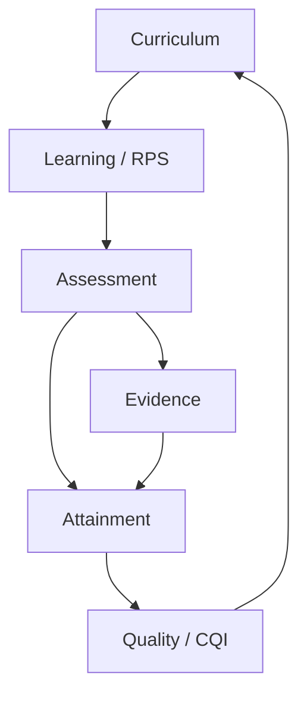

# Arsitektur

OBE Apps adalah modular monolith. PostgreSQL menyimpan state kanonik; cache, analytics read model, export, event delivery, dan keluaran AI dapat dibangun ulang.

Seluruh keputusan baseline pada dokumen ini berstatus **accepted**. Perubahan arsitektur, teknologi, batas domain, atau nonfunctional requirement wajib melalui PR yang memperbarui dokumen, traceability, test, dan rencana rollback.

## Aliran data utama

Setiap write kritis dilakukan oleh service domain dalam transaksi database. Audit append-only dan outbox event dibuat dalam transaksi yang sama. Consumer memakai idempotency key; side effect asynchronous tidak boleh menjadi transaksi utama nilai.

## Pemilik modul

| Modul | Accountable owner | Tanggung jawab utama |
|---|---|---|
| Identity, Curriculum, Academic Lifecycle | Prodi | kebijakan akademik, akses, kurikulum, lifecycle |
| Learning, Assessment | Pengampu/Koordinator | RPS, aktivitas, asesmen, nilai |
| Evidence | Pemilik objek akademik; GPM sebagai verifier | manifest, akses, verifikasi bukti |
| Analytics, Quality | GPM/TPMF | semantic metric, integritas, PPEPP/CQI |
| AI | Operator platform; owner bisnis tetap domain pemanggil | gateway, policy, quota, fallback |
| Secure Exam | Koordinator/Penguji; operator Exam Edge | authoring, sesi, bundle, rekonsiliasi |
| Integration | Prodi dan operator integrasi | staging, validasi, rekonsiliasi |
| Shared kernel dan deployment | Maintainer platform | audit, outbox, flags, rules, operasi |

## Dependency rule

- Domain tidak mengimpor `models.py` domain lain.
- Cross-domain read/write hanya melalui service, selector, command, atau event contract.
- `shared` terbatas pada identity primitive, audit, time, tenancy-ready scope, rule, event, dan file manifest.
- Semua model AI dipanggil melalui `obe.ai.gateway` menuju LiteLLM.
- Exam Edge memakai codebase yang sama, konfigurasi minimal, jaringan internal, dan AI selalu nonaktif.

Architecture test mengekstrak graph impor dari AST. Pipeline gagal pada siklus dependency, direct import model lintas domain, direct AI client/endpoint di luar gateway, syntax error, AppConfig yang hilang, atau template modul yang tidak lengkap.

## Aturan evolusi schema dan API

- Perubahan schema selalu melalui migration bernomor dan diuji dengan `makemigrations --check` serta pemeriksa reversibility.
- `RunPython` memerlukan `reverse_code`; `RunSQL` memerlukan `reverse_sql`. Pengecualian hanya lewat forward-fix plan yang disetujui dan dicatat di PR.
- Identifier publik stabil dan tidak boleh digunakan ulang. Rename dilakukan dengan expand/migrate/contract, bukan perubahan breaking satu tahap.
- API, semantic JSON, dan domain event memiliki versi eksplisit. Consumer lama dipertahankan selama window transisi.
- Breaking change membutuhkan contract baru, migration plan, feature flag, audit dampak data, dan rollback/reconciliation plan.

## Zona jaringan

| Zona | Isi | Akses |
|---|---|---|
| Public proxy | Nginx/TLS | 443 dari pengguna |
| Application | Django, Celery | hanya proxy/admin network |
| Data | PostgreSQL, Valkey, RabbitMQ | hanya application |
| AI | LiteLLM, Ollama/vLLM | hanya worker AI; tidak ada route dari Exam Edge |
| Observability | OTel, Prometheus, Grafana, Loki | admin/VPN |
| Exam Edge | edge web, local PostgreSQL, sync agent | VLAN ujian; deny-by-default |

## SLO baseline

- Core read p95 ≤2,5 detik; error <1%.
- Analytics p95 ≤2,5 detik pada data 10× pilot.
- Autosave ujian p95 ≤1,5 detik.
- Availability pilot ≥99,5%.
- Backup RPO ≤24 jam dan restore RTO ≤120 menit.

## Keputusan teknologi accepted

Django/DRF, HTMX, Tailwind CSS, PostgreSQL, Valkey, RabbitMQ/Celery, ECharts lokal, Nginx, Docker Compose, Ansible, dan SOPS adalah baseline yang disetujui. PostgreSQL adalah satu-satunya source of truth; seluruh cache, report, index, analytics projection, dan hasil AI merupakan state turunan yang dapat dibangun ulang.
