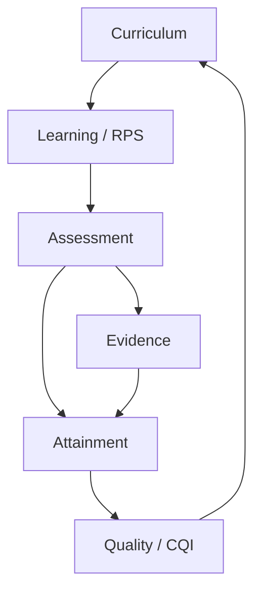

# Arsitektur

OBE Apps adalah modular monolith. PostgreSQL menyimpan state kanonik; cache, analytics read model, export, event delivery, dan keluaran AI dapat dibangun ulang.

## Aliran data utama

Setiap write kritis dilakukan oleh service domain dalam transaksi database. Audit append-only dan outbox event dibuat dalam transaksi yang sama. Consumer memakai idempotency key; side effect asynchronous tidak boleh menjadi transaksi utama nilai.

## Dependency rule

- Domain tidak mengimpor `models.py` domain lain.
- Cross-domain read/write hanya melalui service, selector, command, atau event contract.
- `shared` terbatas pada identity primitive, audit, time, tenancy-ready scope, rule, event, dan file manifest.
- Semua model AI dipanggil melalui `obe.ai.gateway` menuju LiteLLM.
- Exam Edge memakai codebase yang sama, konfigurasi minimal, jaringan internal, dan AI selalu nonaktif.

## Zona jaringan

| Zona | Isi | Akses |
|---|---|---|
| Public proxy | Nginx/TLS | 443 dari pengguna |
| Application | Django, Celery | hanya proxy/admin network |
| Data | PostgreSQL, Valkey, RabbitMQ | hanya application |
| AI | LiteLLM, Ollama/vLLM | hanya worker AI; tidak ada route dari Exam Edge |
| Observability | OTel, Prometheus, Grafana, Loki | admin/VPN |
| Exam Edge | edge web, local PostgreSQL, sync agent | VLAN ujian; deny-by-default |

## SLO baseline

- Core read p95 ≤2,5 detik; error <1%.
- Analytics p95 ≤2,5 detik pada data 10× pilot.
- Autosave ujian p95 ≤1,5 detik.
- Availability pilot ≥99,5%.
- Backup RPO ≤24 jam dan restore RTO ≤120 menit.

