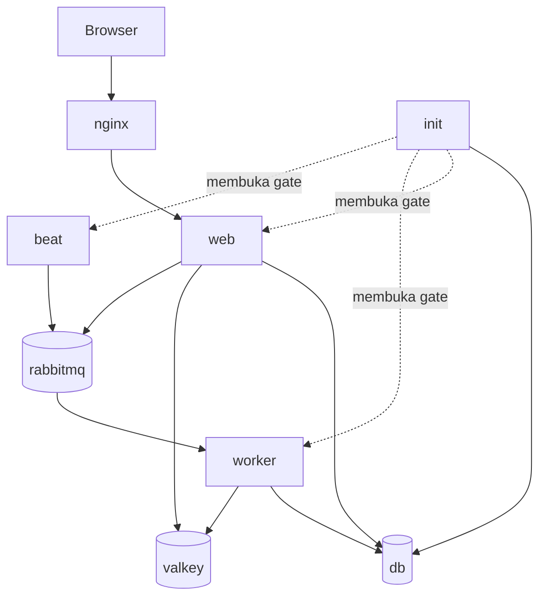

# Cerita delapan container OBE Apps

Docker Compose lokal menjalankan delapan service. Tujuh service tetap hidup selama aplikasi dipakai, sedangkan `init` bekerja satu kali lalu berhenti dengan exit code `0`. Pembagian ini membuat setiap container mempunyai satu tanggung jawab dan memudahkan pencarian sumber masalah.

## Gambaran besar



Hanya `nginx` yang membuka port ke komputer pengguna. Database, cache, dan broker tetap berada di jaringan internal Compose.

## Delapan container dan tugasnya

| Service | Peran sederhana | Tanggung jawab | Status normal |
|---|---|---|---|
| `db` | Lemari arsip utama | PostgreSQL menyimpan akun, kurikulum, RPS, nilai, audit, task, dan data akademik kanonis. | `Up (healthy)` |
| `valkey` | Meja kerja cepat | Menyimpan session login, cache, rate limit, lock, dan state sementara. Bukan sumber kebenaran akademik. | `Up (healthy)` |
| `rabbitmq` | Loket antrean | Menerima pekerjaan Celery dari web/beat dan menyerahkannya kepada worker. Management UI tidak dipublikasikan ke host. | `Up (healthy)` |
| `init` | Petugas pembukaan | Menunggu data services sehat, menjalankan migration, lalu menyinkronkan seed dan akun demo lokal. | `Exited (0)` setelah selesai |
| `web` | Petugas layanan utama | Gunicorn + Django menerima login, halaman HTMX, API, validasi, dan transaksi bisnis. | `Up (healthy)` |
| `worker` | Petugas pekerjaan belakang | Celery mengerjakan job asinkron seperti rekonsiliasi, kalkulasi, impor, dan maintenance dari RabbitMQ. | `Up` |
| `beat` | Jam/pengatur jadwal | Celery Beat mengirim pekerjaan berkala ke RabbitMQ; ia tidak mengerjakan job sendiri. | `Up` |
| `nginx` | Pintu depan | Menerima trafik `localhost`, menerapkan header/rate limit, lalu meneruskan request ke web. | `Up (healthy)` |

`init`, `web`, `worker`, dan `beat` memakai image aplikasi yang sama (`obe-apps-web:local`), tetapi menjalankan mode/perintah berbeda. Ini menghindari empat build aplikasi yang isinya identik.

## Urutan startup

Saat `./scripts/quickstart.sh` dijalankan, alurnya adalah:

1. quickstart memeriksa Docker, menyiapkan `.env`, lalu membangun image aplikasi dan Nginx;
2. `db`, `valkey`, dan `rabbitmq` dinyalakan dan harus lulus health check;
3. `init` menjalankan `python manage.py migrate --noinput`;
4. pada profil lokal, `init` menjalankan `python manage.py seed_demo` untuk menyinkronkan data serta password akun demo;
5. `init` berhenti dengan exit code `0`;
6. Compose membuka gate `service_completed_successfully`, kemudian menyalakan `web`, `worker`, dan `beat`;
7. setelah health check `web` berhasil, `nginx` mulai melayani trafik; dan
8. quickstart memeriksa Nginx sebelum menampilkan `OBE Apps siap`.

Pesan `No migrations to apply` pada log `init` berarti langkah ketiga berhasil dan database sudah terbaru. Ini bukan error. Jika `init` exit selain `0`, web/worker/beat tidak akan dimulai agar aplikasi tidak berjalan dengan schema yang salah.

## Cerita sebuah request

### Login dan halaman biasa

1. Browser membuka `http://localhost:8000`.
2. `nginx` menerima request dan meneruskannya ke `web` sambil mempertahankan host/port untuk pemeriksaan CSRF.
3. `web` memeriksa akun dan permission di `db`.
4. Session login dan cache singkat disimpan melalui `valkey`.
5. Respons kembali melalui `nginx` ke browser.

### Pekerjaan asinkron

1. `web` menyimpan transaksi kanonis ke `db`.
2. Pekerjaan yang tidak harus selesai di request yang sama dikirim ke `rabbitmq`.
3. `worker` mengambil job dari antrean, membaca data kanonis, lalu menyimpan hasil yang sah ke `db`.
4. State sementara, lock, atau cache dapat memakai `valkey`.

Jika `worker` berhenti, halaman biasa masih dapat dibuka, tetapi job background akan menunggu di RabbitMQ.

### Pekerjaan terjadwal

1. `beat` menentukan bahwa jadwal tertentu sudah jatuh tempo.
2. `beat` mengirim task ke `rabbitmq`.
3. `worker` mengambil dan menjalankan task tersebut.

Jika `beat` berhenti, task manual tetap dapat berjalan, tetapi task berkala baru tidak akan diterbitkan.

## Data yang tetap ada saat container dibuat ulang

| Volume | Dipakai oleh | Isi |
|---|---|---|
| `postgres-data` | `db` | Seluruh data akademik dan aplikasi |
| `valkey-data` | `valkey` | Cache/state sementara yang dipersistensikan |
| `rabbitmq-data` | `rabbitmq` | Antrean dan metadata broker |
| `evidence-data` | aplikasi | Evidence/bukti yang disimpan aplikasi |
| `uploads-data` | aplikasi | File unggahan |

`./scripts/quickstart.sh --clean` membuat ulang container tanpa menghapus volume tersebut. Sebaliknya, `docker compose down --volumes` menghapus data lokal dan hanya boleh dipakai untuk reset total yang disengaja.

## Cara membaca status

Gunakan:

```bash
docker compose ps --all
```

Kondisi yang diharapkan:

- `init`: `Exited (0)`;
- `db`, `valkey`, `rabbitmq`, `web`, dan `nginx`: berjalan serta healthy; dan
- `worker` dan `beat`: berjalan (`Up`).

Container `init` yang berhenti dengan kode `0` tidak perlu dihidupkan manual. Quickstart akan membuat ulang `init` saat startup berikutnya.

## Peta diagnosis cepat

| Gejala | Container pertama yang diperiksa | Perintah |
|---|---|---|
| Migration atau seed gagal | `init`, lalu `db` | `docker compose logs --tail=100 init db` |
| Website tidak dapat dibuka | `nginx`, lalu `web` | `docker compose logs --tail=100 nginx web` |
| Login/session bermasalah | `web`, `valkey`, lalu `nginx` | `docker compose logs --tail=100 web valkey nginx` |
| Job background tidak bergerak | `worker`, lalu `rabbitmq` | `docker compose logs --tail=100 worker rabbitmq` |
| Job berkala tidak muncul | `beat`, `rabbitmq`, lalu `worker` | `docker compose logs --tail=100 beat rabbitmq worker` |
| Database tidak siap | `db` | `docker compose logs --tail=100 db` |

Untuk mengikuti alur request utama secara langsung:

```bash
docker compose logs --follow nginx web
```

Untuk instalasi dan pemulihan, tetap gunakan satu jalur resmi:

```bash
./scripts/quickstart.sh --clean
```

